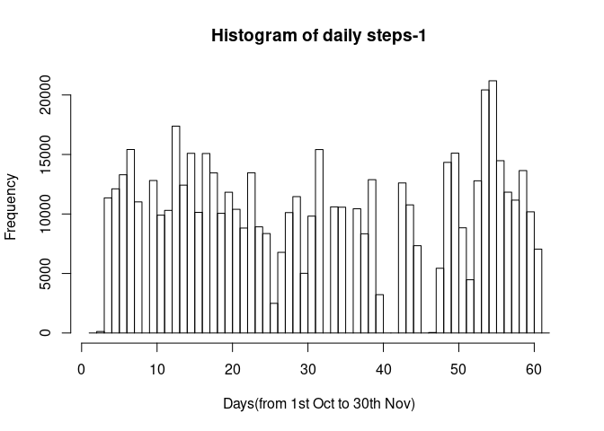
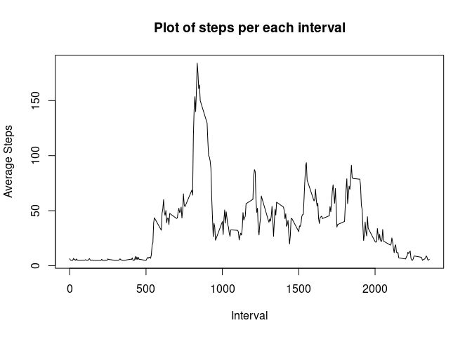
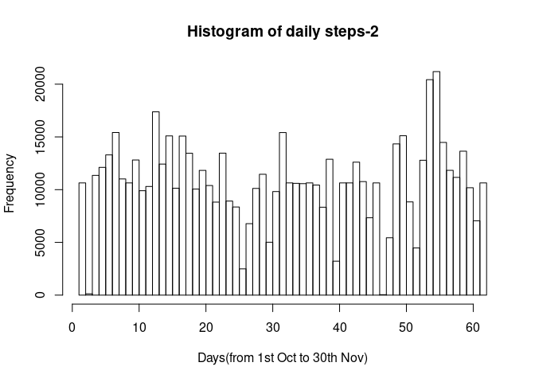
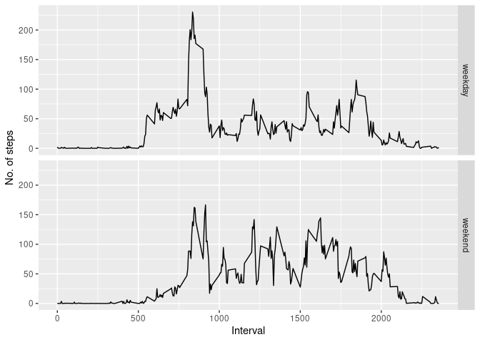

## Loading and preprocessing the data
Let's load the data by using "read.csv" function.

```r
unzip("activity.zip")
df = read.csv("activity.csv")
```

So, we have loaded the dataframe, let's check out the columns.

```r
str(df)
```

```
## 'data.frame':	17568 obs. of  3 variables:
##  $ steps   : int  NA NA NA NA NA NA NA NA NA NA ...
##  $ date    : chr  "2012-10-01" "2012-10-01" "2012-10-01" "2012-10-01" ...
##  $ interval: int  0 5 10 15 20 25 30 35 40 45 ...
```

As we can see the date column is in character class, let's change its datatype into date.

```r
df[,2] = as.Date(df[,2])
str(df)
```

```
## 'data.frame':	17568 obs. of  3 variables:
##  $ steps   : int  NA NA NA NA NA NA NA NA NA NA ...
##  $ date    : Date, format: "2012-10-01" "2012-10-01" ...
##  $ interval: int  0 5 10 15 20 25 30 35 40 45 ...
```

## What is mean total number of steps taken per day?
Now let's calculate the total number of steps taken per day.

```r
dftotal = aggregate(df[,1],list(df[,2]), FUN = sum)
```

After getting the total steps taken per day, we will now plot the histogram of the new dataframe.

```r
Freq <- dftotal[,2]
for(i in seq_along(Freq)){
    if(is.na(Freq[i])){
    Freq[i]=0 #replacing NA values with 0
    }
}
Overall.Cond <- 1:(length(Freq)+1)
myhist <-list(breaks=Overall.Cond, counts=Freq, density=Freq/diff(Overall.Cond),xname="Days(from 1st Oct to 30th Nov)", ylab="No of steps")
class(myhist) <- "histogram"
plot(myhist, main = "Histogram of daily steps-1")
```

<!-- -->

Now we have to calculate and report the mean and median of the total number of steps taken per day.

```r
dfc = df
for(i in seq_along(dfc[,1])){
    if(is.na(dfc[i,1])){
        dfc[i,1]=mean(df[,1],na.rm = TRUE)
    }
}
dfavg = aggregate(dfc[,1],list(dfc[,2]), FUN = mean)
dfmedian = aggregate(dfc[,1],list(dfc[,2]), FUN = median)
dfavg = cbind(dfavg,dfmedian[,2])
names(dfavg) = c("Date","Mean","Median")
dfavg
```

```
##          Date       Mean  Median
## 1  2012-10-01 37.3825996 37.3826
## 2  2012-10-02  0.4375000  0.0000
## 3  2012-10-03 39.4166667  0.0000
## 4  2012-10-04 42.0694444  0.0000
## 5  2012-10-05 46.1597222  0.0000
## 6  2012-10-06 53.5416667  0.0000
## 7  2012-10-07 38.2465278  0.0000
## 8  2012-10-08 37.3825996 37.3826
## 9  2012-10-09 44.4826389  0.0000
## 10 2012-10-10 34.3750000  0.0000
## 11 2012-10-11 35.7777778  0.0000
## 12 2012-10-12 60.3541667  0.0000
## 13 2012-10-13 43.1458333  0.0000
## 14 2012-10-14 52.4236111  0.0000
## 15 2012-10-15 35.2048611  0.0000
## 16 2012-10-16 52.3750000  0.0000
## 17 2012-10-17 46.7083333  0.0000
## 18 2012-10-18 34.9166667  0.0000
## 19 2012-10-19 41.0729167  0.0000
## 20 2012-10-20 36.0937500  0.0000
## 21 2012-10-21 30.6284722  0.0000
## 22 2012-10-22 46.7361111  0.0000
## 23 2012-10-23 30.9652778  0.0000
## 24 2012-10-24 29.0104167  0.0000
## 25 2012-10-25  8.6527778  0.0000
## 26 2012-10-26 23.5347222  0.0000
## 27 2012-10-27 35.1354167  0.0000
## 28 2012-10-28 39.7847222  0.0000
## 29 2012-10-29 17.4236111  0.0000
## 30 2012-10-30 34.0937500  0.0000
## 31 2012-10-31 53.5208333  0.0000
## 32 2012-11-01 37.3825996 37.3826
## 33 2012-11-02 36.8055556  0.0000
## 34 2012-11-03 36.7048611  0.0000
## 35 2012-11-04 37.3825996 37.3826
## 36 2012-11-05 36.2465278  0.0000
## 37 2012-11-06 28.9375000  0.0000
## 38 2012-11-07 44.7326389  0.0000
## 39 2012-11-08 11.1770833  0.0000
## 40 2012-11-09 37.3825996 37.3826
## 41 2012-11-10 37.3825996 37.3826
## 42 2012-11-11 43.7777778  0.0000
## 43 2012-11-12 37.3784722  0.0000
## 44 2012-11-13 25.4722222  0.0000
## 45 2012-11-14 37.3825996 37.3826
## 46 2012-11-15  0.1423611  0.0000
## 47 2012-11-16 18.8923611  0.0000
## 48 2012-11-17 49.7881944  0.0000
## 49 2012-11-18 52.4652778  0.0000
## 50 2012-11-19 30.6979167  0.0000
## 51 2012-11-20 15.5277778  0.0000
## 52 2012-11-21 44.3993056  0.0000
## 53 2012-11-22 70.9270833  0.0000
## 54 2012-11-23 73.5902778  0.0000
## 55 2012-11-24 50.2708333  0.0000
## 56 2012-11-25 41.0902778  0.0000
## 57 2012-11-26 38.7569444  0.0000
## 58 2012-11-27 47.3819444  0.0000
## 59 2012-11-28 35.3576389  0.0000
## 60 2012-11-29 24.4687500  0.0000
## 61 2012-11-30 37.3825996 37.3826
```

## What is the average daily activity pattern?
This time, we will find the steps per each 5 minute interval averaged across all days.

```r
df5min = aggregate(dfc[,1],list(dfc[,3]), FUN = mean)
names(df5min)[1] = 'Interval'
head(df5min)
```

```
##   Interval        x
## 1        0 6.394439
## 2        5 5.197718
## 3       10 5.017390
## 4       15 5.033784
## 5       20 4.968210
## 6       25 6.722308
```

So as we have git the average steps per each interval dataset, let's plot it.

```r
plot(df5min[,1],df5min[,2], type='l',xlab="Interval",ylab="Average Steps", main = "Plot of steps per each interval")
```

<!-- -->

Now let's find which 5-minute interval, on average across all the days in the dataset, contains the maximum number of steps.

```r
ansmin = df5min[(df5min[,2]==max(df5min[,2])),1]
ansmin
```

```
## [1] 835
```

Thus we found that at interval `835` there is maximum number of steps.

## Imputing missing values
Now let's count the total number of missing values in the dataset.

```r
a=sum(is.na(df[,1]))
b=sum(is.na(df[,2]))
c=sum(is.na(df[,3]))
c(a,b,c)
```

```
## [1] 2304    0    0
```

So there are `2304` rows in the dataframe with NAs.
To clean the dataset, let's replace the NAs with the median value of steps for corresponding day.

```r
df2 = df
for(i in seq_along(df2[,1])){
    if(is.na(df2[i,1])){
        subset2 = subset(df2,interval==df[i,3])
        df2[i,1]=as.integer(mean(subset2[,1],na.rm = TRUE))
    }
}
dfavg2 = aggregate(df2[,1],list(df2[,2]), FUN = mean)
dfmedian2 = aggregate(df2[,1],list(df2[,2]), FUN = median)
dfavg2 = cbind(dfavg2,dfmedian2[,2])
names(dfavg2) = c("Date","Mean","Median")
dfavg2
```

```
##          Date       Mean Median
## 1  2012-10-01 36.9479167   33.5
## 2  2012-10-02  0.4375000    0.0
## 3  2012-10-03 39.4166667    0.0
## 4  2012-10-04 42.0694444    0.0
## 5  2012-10-05 46.1597222    0.0
## 6  2012-10-06 53.5416667    0.0
## 7  2012-10-07 38.2465278    0.0
## 8  2012-10-08 36.9479167   33.5
## 9  2012-10-09 44.4826389    0.0
## 10 2012-10-10 34.3750000    0.0
## 11 2012-10-11 35.7777778    0.0
## 12 2012-10-12 60.3541667    0.0
## 13 2012-10-13 43.1458333    0.0
## 14 2012-10-14 52.4236111    0.0
## 15 2012-10-15 35.2048611    0.0
## 16 2012-10-16 52.3750000    0.0
## 17 2012-10-17 46.7083333    0.0
## 18 2012-10-18 34.9166667    0.0
## 19 2012-10-19 41.0729167    0.0
## 20 2012-10-20 36.0937500    0.0
## 21 2012-10-21 30.6284722    0.0
## 22 2012-10-22 46.7361111    0.0
## 23 2012-10-23 30.9652778    0.0
## 24 2012-10-24 29.0104167    0.0
## 25 2012-10-25  8.6527778    0.0
## 26 2012-10-26 23.5347222    0.0
## 27 2012-10-27 35.1354167    0.0
## 28 2012-10-28 39.7847222    0.0
## 29 2012-10-29 17.4236111    0.0
## 30 2012-10-30 34.0937500    0.0
## 31 2012-10-31 53.5208333    0.0
## 32 2012-11-01 36.9479167   33.5
## 33 2012-11-02 36.8055556    0.0
## 34 2012-11-03 36.7048611    0.0
## 35 2012-11-04 36.9479167   33.5
## 36 2012-11-05 36.2465278    0.0
## 37 2012-11-06 28.9375000    0.0
## 38 2012-11-07 44.7326389    0.0
## 39 2012-11-08 11.1770833    0.0
## 40 2012-11-09 36.9479167   33.5
## 41 2012-11-10 36.9479167   33.5
## 42 2012-11-11 43.7777778    0.0
## 43 2012-11-12 37.3784722    0.0
## 44 2012-11-13 25.4722222    0.0
## 45 2012-11-14 36.9479167   33.5
## 46 2012-11-15  0.1423611    0.0
## 47 2012-11-16 18.8923611    0.0
## 48 2012-11-17 49.7881944    0.0
## 49 2012-11-18 52.4652778    0.0
## 50 2012-11-19 30.6979167    0.0
## 51 2012-11-20 15.5277778    0.0
## 52 2012-11-21 44.3993056    0.0
## 53 2012-11-22 70.9270833    0.0
## 54 2012-11-23 73.5902778    0.0
## 55 2012-11-24 50.2708333    0.0
## 56 2012-11-25 41.0902778    0.0
## 57 2012-11-26 38.7569444    0.0
## 58 2012-11-27 47.3819444    0.0
## 59 2012-11-28 35.3576389    0.0
## 60 2012-11-29 24.4687500    0.0
## 61 2012-11-30 36.9479167   33.5
```
As we have calculated the means and medians of total number of steps taken per day, let's make a histogram of the total number of steps taken each day.

```r
dftotal2 = aggregate(df2[,1],list(df2[,2]), FUN = sum)
Freq <- dftotal2[,2]
sum(is.na(Freq))
```

```
## [1] 0
```

```r
Overall.Cond <- 1:(length(Freq)+1)
myhist <-list(breaks=Overall.Cond, counts=Freq, density=Freq/diff(Overall.Cond),xname="Days(from 1st Oct to 30th Nov)", ylab="No of steps")
class(myhist) <- "histogram"
plot(myhist, main = "Histogram of daily steps-2")
```

<!-- -->

The difference between the plots with the 2 different kinds of imputations is not quite noteworthy. 

## Are there differences in activity patterns between weekdays and weekends


Now let's create a new factor variable in the dataset with two levels – “weekday” and “weekend” indicating whether a given date is a weekday or weekend day.


```r
df2[,4]=weekdays(df2[,2])
dayz = unique(df2[,4])
for(i in seq_along(dayz)){
  if(i<6){
    df2[,4]=gsub(dayz[i],"weekday",df2[,4])
  }
  else{
    df2[,4]=gsub(dayz[i],"weekend",df2[,4])
  }
}
df2$V4 = as.factor(df2$V4)
names(df2)[4] = "daytype"
```

Having created the 4th column of the day-type, let's make 2 plots of  the average number of steps taken across all weekday days and weekend days per all 5-minute interval.


```r
library(ggplot2)
dfag = aggregate(df2[,1],list(df2[,3],df2[,4]),FUN=mean)
qplot(Group.1,x,data=dfag,facets = 'Group.2',geom = 'line',xlab = 'Interval',ylab = 'No. of steps')
```

<!-- -->

We can notice that on weekend days the average steps are more than weekday days, while during peak hours, the number of steps taken is higher on weekdays.
